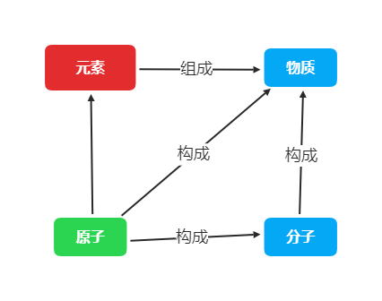
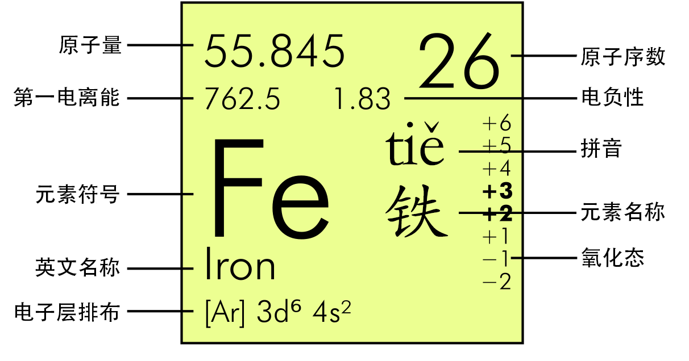

# 化学

---

## 第三单元 物质构成的奥秘

### 课题1 分子和原子

#### 一、物质由微观粒子组成:构成物质的粒子有分子、原子、离子等

#### 二、微观粒子(以分子为例)的性质

1. **分子的体积和质量都很小**
2. **分子是在不断运动的**
3. **温度越高**，**分子运动速率越快**
4. **分子之间有间隔**
5. **同种分子的化学性质相同**，**不同种分子的化学性质不同**

##### 探究分子运动实验的改进装置优点

1. 药品用量少，布条可重复利用
2. 实验完全封闭，没有污染
3. 实验需要时间短，现象明显
4. 可浸在热水中探究温度对分子运动速率的影响

#### 三、分子可以分为原子

##### (1) 分子的定义:分子是保持化学性质的最小粒子

##### (2) 原子的定义:原子是化学变化中的最小粒子
---
### 课题2 原子的结构

#### 一、原子的构成

##### (1)原子的构成

$$\text{原子}\left\{\begin{array}{l}\text{原子核}\left\{\begin{array}{l}\text{质子:每个质子带一个单位正电荷}\\\\\text{中子:不带电}\\\end{array}\right.\\\\\text{核外电子:每个电子带一个单位负电荷}\\\end{array}\right.$$

##### (2)关系

1. 核电荷数=质子数=核外电子数
2. 原子不显电性
3. 原子核内不一定有中子

#### 二、核外电子的排布

##### (1)排布规律

1. 核外电子总是优先排布在能量最低的电子层上，只有当能量低的电子层被排满后，才能排布在能量较高的电子层上
2. 第一层最多容纳2个电子，第二层最多容纳8个电子，第$n$层最多容纳$2n^2$个电子
3. 最外层电子数不超过8个，第一层为最外层时不超过2个

#### 三、原子结构示意图

|              |   最外层电子数    |  结构稳定性  |
| :----------: | :---------------: | :----------: |
| 稀有气体原子 |   8个(He为2个)    | 相对稳定结构 |
|   金属原子   |    一般少于4个    |  不稳定结构  |
|  非金属原子  | 一般多于或等于4个 |  不稳定结构  |

#### 四、离子的形成

##### (1)离子的定义:带电的原子叫作离子
##### (2)离子的分类
$$\text{离子}\left\{ \begin{array}{l}\text{阳离子:带正电荷的离子，如钠离子}\left( \text{Na}^+ \right)\\\\\text{阴离子:带负电荷的离子，如氯离子}\left( \text{Cl}^- \right)\\\end{array} \right. $$

#### 五、相对原子质量
##### (1)定义:以$^{12}C$原子质量的$\frac{1}{12}$为标准，其他原子质量与它相比较所得到的比，作为这种原子的相对原子质量($A_r$)

##### (2)计算公式:$\mathbf{A_r=\frac{m(Atom)}{m(^{12}C) \times \frac{1}{12}}\approx\text{质子数+中子数}}$

---
### 课题3 元素

#### 一、元素

##### (1)定义:元素是质子数(核电荷数)相同的一类原子的总称

##### (2)元素的种类在化学反应前后不变
###### 在化学反应前后原子的种类和元素的种类都不变，分子的种类发生了改变

##### (3)元素在自然界中的分布:氧、硅、铝、铁、钙、钠、钾、镁

##### (4)元素的分类
$$\text{元素}\left\{ \begin{array}{l}\text{金属元素:如铁、铜、钙、汞}\\\\\text{非金属元素:如碳、氧、氮、氦}\\\end{array} \right. $$

##### (5)物质、元素、原子、分子之间的关系

#### 二、元素符号

##### (1):元素符号的含义:表示一种元素，还表示这种元素的一个原子

#### 三、元素周期表
##### (1)结构:分为7个周期、16个族(8,9,10共同组成ⅧA族)
##### (2)每一格的意义

